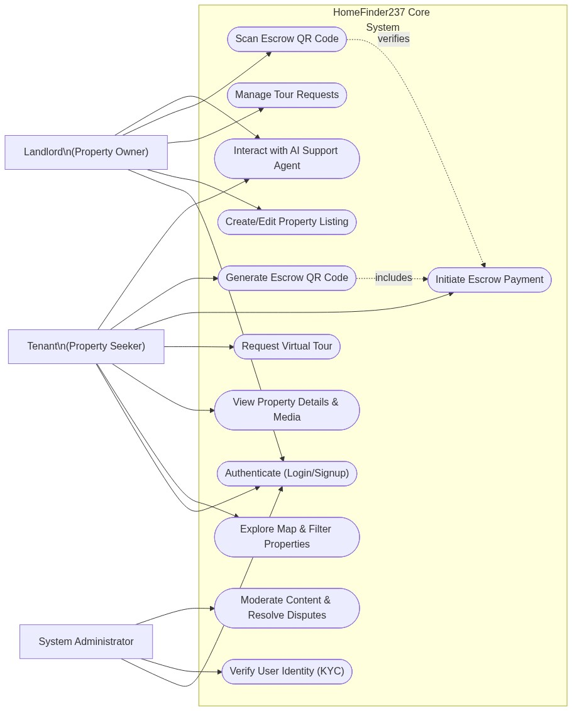
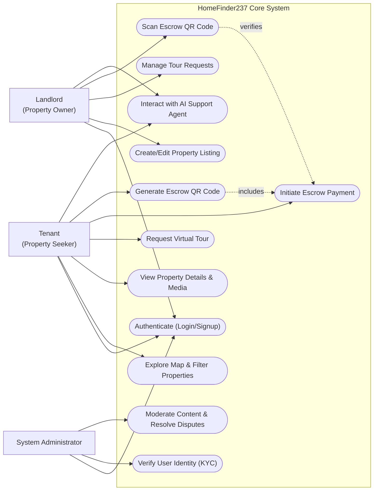
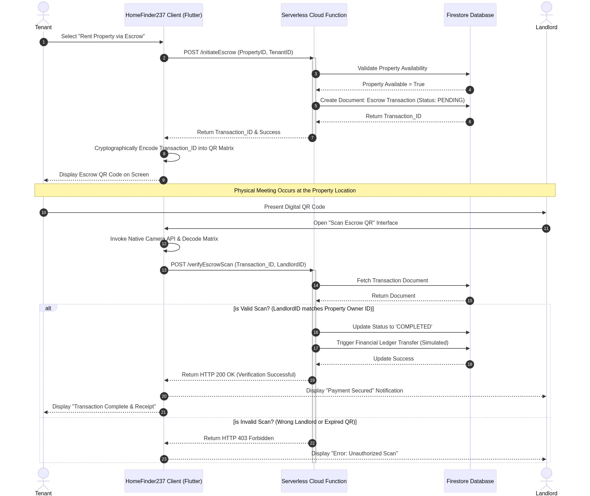
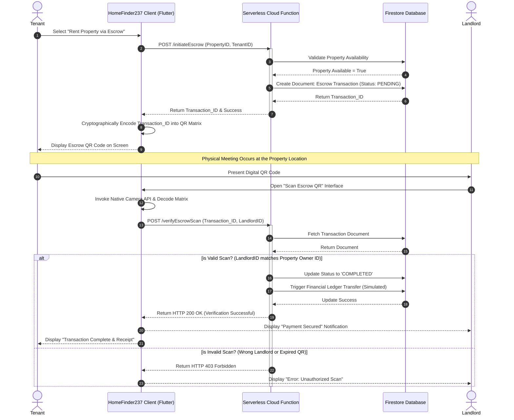
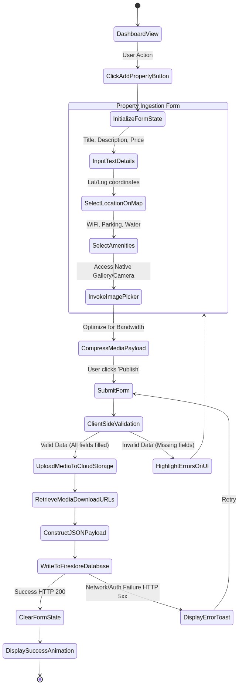
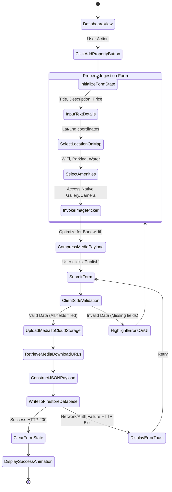

# CHAPTER THREE: MATERIALS AND METHODS USED

## 3.1. Introduction
This chapter delineates the comprehensive methodological framework, the software engineering lifecycle models, and the specific technological materials utilized in the conceptualization, design, and deployment of the HomeFinder237 application. Furthermore, it presents a rigorous systemic analysis, transmuting abstract user needs into concrete, mathematically sound functional and non-functional requirements. The chapter concludes with a detailed architectural blueprint utilizing the Unified Modeling Language (UML) to visualize the complex dynamic and static interactions within the system. The methodology adopted ensures that the final software product is not only robust and scalable but also fundamentally aligned with the socio-economic exigencies identified in Chapter One.

## 3.2. Development Methodology Used

The development of HomeFinder237 adhered strictly to the **Agile Software Development Methodology**, specifically utilizing the **Scrum** framework. The traditional Waterfall model, characterized by rigid, sequential phases (Requirements -> Design -> Implementation -> Verification -> Maintenance), was deemed inherently unsuitable for this project. Real estate market dynamics, user interaction paradigms with AI, and the nuances of geospatial mapping require a highly flexible, iterative approach capable of adapting to continuous feedback.

### 3.2.1. The Scrum Framework and Iterative Sprints
The project lifecycle was partitioned into bi-weekly iterations known as *Sprints*. Each sprint constituted a time-boxed effort aimed at delivering a distinct, fully functional, and testable increment of the application. 
*   **Sprint Planning:** At the genesis of each sprint, the "Product Backlog" (a prioritized list of all desired features, formulated during the initial requirements gathering phase) was evaluated. A subset of high-priority items was moved to the "Sprint Backlog." For example, Sprint 1 focused entirely on the Firebase Authentication flow (Login/Signup/Role Assignment). Sprint 3 was dedicated entirely to the integration of the `flutter_map` and geospatial querying.
*   **Daily Stand-ups (Simulated):** To maintain momentum and address immediate technical blockers, simulated daily code reviews were conducted. This ensured that architectural deviations were corrected instantaneously, preventing the accumulation of "technical debt."
*   **Sprint Review and Retrospective:** At the culmination of each sprint, the newly developed module was rigorously tested against the defined acceptance criteria. If a module (e.g., the Escrow QR Scanner) failed to perform under edge-case scenarios (such as low ambient lighting for the scanner), it was returned to the backlog for refinement in the subsequent sprint.

### 3.2.2. Test-Driven Development (TDD) Paradigm
Within the Agile framework, a modified Test-Driven Development (TDD) approach was adopted for critical backend logic, particularly concerning the Escrow financial transactions and Cloud Functions. 
The TDD cycle (Red-Green-Refactor) dictated that before any production code was written for the Escrow system, a unit test was authored defining the expected behavior (e.g., "Given a valid Escrow ID and a matching scanned QR code, the system must update the ledger status to 'Released'"). Initially, this test would fail (Red). The minimal amount of Dart/JavaScript code was then written to make the test pass (Green). Finally, the code was optimized for performance and security (Refactor). This rigorous methodology mathematically guarantees that core financial logic behaves deterministically.

## 3.3. Tools and Material Used

The successful execution of this project required a carefully curated stack of hardware and software resources, selected for their interoperability, performance metrics, and scalability.

### 3.3.1. Hardware Requirements
The development and subsequent deployment of the HomeFinder237 ecosystem necessitated specific hardware baselines.

**Development Environment (Developer Workstation):**
*   **Processor (CPU):** Intel Core i7 (10th Generation or equivalent AMD Ryzen 7). High multi-core performance is absolutely critical for the rapid compilation of the Flutter engine and running simultaneous Android/iOS emulators.
*   **Memory (RAM):** 16 GB DDR4. Essential for concurrently running the IDE (Visual Studio Code), heavy JVM-based Android emulators, Chrome debugging instances, and local database emulators.
*   **Storage:** 512 GB NVMe Solid State Drive (SSD). SSD speeds are required to mitigate the massive I/O bottlenecks inherent in compiling millions of lines of framework code during the build process.

**Deployment Environment (End-User Devices):**
*   **Android:** Devices running Android OS version 8.0 (Oreo) or higher, with a minimum of 2GB RAM. Camera hardware is mandatory for the QR scanning functionality.
*   **iOS:** Devices running iOS 12.0 or higher.
*   **Sensors:** Both platforms require functional GPS sensors for the geospatial map features to operate.

### 3.3.2. Software Requirements and Technological Stack

The software stack represents the architectural core of the project. It is divided into Frontend, Backend, and Third-Party API integrations.

**1. The Frontend Framework: Flutter and Dart**
*   **Flutter SDK (v3.10.7+):** Chosen for its unparalleled cross-platform capabilities. Flutter compiles directly to native ARM code, completely bypassing the JavaScript bridge used by competitors like React Native. This allows the application to achieve a consistent 60 Frames Per Second (FPS), which is non-negotiable for rendering smooth map interactions and video player interfaces.
*   **Dart Programming Language:** The underlying language of Flutter. Its strong typing, null safety (preventing a massive class of runtime crashes), and support for asynchronous programming (Futures/Streams) make it highly resilient for complex state management.
*   **State Management (Provider):** The `provider` package (v6.1.1) was utilized to manage the application's complex global state (e.g., User Authentication status, current Theme, selected Locale). It utilizes the InheritedWidget paradigm to efficiently rebuild only the specific UI components that rely on altered data, preventing massive memory leaks and CPU over-utilization.

**2. The Backend Infrastructure: Firebase and Supabase**
*   **Google Firebase:** Utilized as the primary Backend-as-a-Service (BaaS).
    *   *Firebase Authentication:* Handles the complex cryptography of user identity verification (Email/Password, Google OAuth).
    *   *Cloud Firestore:* A NoSQL, document-oriented database. Used for storing highly unstructured, rapidly changing data such as real-time chat messages and user profile metadata. Its real-time synchronization capabilities (via WebSockets) power the instantaneous chat features.
    *   *Cloud Functions (Node.js):* Serverless compute environments used to execute secure, backend-only logic that cannot be trusted to the client application (e.g., executing the final ledger update upon a successful Escrow QR scan).
*   **Supabase:** An open-source Firebase alternative built on PostgreSQL. While Firestore handles real-time unstructured data, Supabase is theorized to be used for the complex, highly relational data associated with properties (e.g., executing complex spatial queries combining price ranges, specific amenities, and exact longitudinal/latitudinal boundaries).

**3. Critical Third-Party Integrations and APIs**
*   **Google Generative AI SDK (`google_generative_ai: ^0.4.7`):** The cornerstone of the "AI Agent" module. This SDK provides the interface to communicate with advanced Large Language Models (LLMs). It processes user queries in natural language, contextualizes them against a systemic prompt defining the agent's persona, and streams the intelligent response back to the UI.
*   **Geospatial Stack (`flutter_map`, `latlong2`, `geolocator`, `geocoding`):** This combination of libraries replaces proprietary, highly expensive mapping solutions (like Google Maps SDK). `flutter_map` renders raster tiles, `latlong2` handles the complex geodesic mathematics for calculating distances on the Earth's curvature, and `geolocator` interfaces with the device's physical GPS hardware.
*   **Hardware Interfacing (`mobile_scanner`, `qr_flutter`):** These libraries are the physical bridge for the Escrow system. `qr_flutter` generates mathematically unique Matrix barcodes encoding transaction IDs, while `mobile_scanner` utilizes the device camera and native machine vision APIs to decode them instantaneously.

## 3.4. System Modules
The architecture of HomeFinder237 is modular, ensuring code maintainability and the principle of separation of concerns.

1.  **Identity and Access Management (IAM) Module:** Encapsulates `signin_screen.dart`, `signup_screen.dart`, and `auth_service.dart`. It dictates who the user is and what they are authorized to see based on their role (Tenant, Landlord, Admin).
2.  **Property Ingestion and Display Module:** The core data engine. It includes `add_property_screen.dart` (data input with media processing) and `property_details_screen.dart` (data rendering).
3.  **Geospatial Discovery Module:** Primarily `explore_screen.dart` and `map_component.dart`. It handles the rendering of maps, clustering of property markers, and processing of spatial bounding boxes to query the backend efficiently.
4.  **Financial Transaction (Escrow) Module:** Comprises `escrow_qr_display_screen.dart` and `escrow_qr_scanner_screen.dart`. It orchestrates the secure, conditional transfer of state representing financial value.
5.  **Cognitive Support Module:** The `ai_agent_screen.dart`. An isolated module that handles all prompt engineering, API rate limiting, and chat UI rendering for the LLM integration.

## 3.5. System Analysis

System analysis involves deconstructing the overarching goals into highly specific, testable requirements.

### 3.5.1. Functional Requirements (FR)
Functional requirements define the specific behaviors and functions the system *must* perform.
*   **FR-01 (Authentication):** The system shall allow users to register an account uniquely identified by an email address and mandate the selection of a primary role (Tenant or Landlord).
*   **FR-02 (Property Creation):** The system shall permit authenticated Landlords to create property listings, requiring mandatory fields (Title, Price, Location coordinates) and optional rich media arrays (Images, Video URLs).
*   **FR-03 (Geospatial Querying):** The system shall display a dynamic map interface to Tenants. Upon dragging or zooming the map, the system shall re-query the database to fetch only the properties that exist within the visible latitudinal/longitudinal bounding box.
*   **FR-04 (Escrow Initialization):** The system shall allow a Tenant to initiate a transaction on a specific property, generating a cryptographically unique Escrow Object in the database with a state of 'PENDING_VERIFICATION'.
*   **FR-05 (Escrow Verification):** The system shall generate a QR code containing the Escrow Object ID on the Tenant's device. When scanned by the specific Landlord's device associated with that property, the system shall trigger a Cloud Function to securely mutate the state to 'COMPLETED'.
*   **FR-06 (AI Conversational Interface):** The system shall provide a chat interface where users can input unstructured text. The system shall route this text to the Google Generative AI API and display the returned text block as a conversational response.

### 3.5.2. Non-Functional Requirements (NFR)
Non-functional requirements specify criteria that judge the operation of a system, rather than specific behaviors.
*   **NFR-01 (Performance/Latency):** Geospatial database queries (fetching properties for the map view) must return and render on the UI within a maximum threshold of 1.5 seconds under standard 4G/LTE network conditions to prevent UI thread blocking.
*   **NFR-02 (Security - Data at Rest):** All sensitive user metadata stored in Firestore/Supabase must be encrypted at rest using AES-256 encryption standards provided by the cloud vendor.
*   **NFR-03 (Security - Transit):** All API communications between the mobile client and the backend servers must occur exclusively over TLS 1.2+ (HTTPS) to prevent Man-in-the-Middle (MITM) packet sniffing attacks.
*   **NFR-04 (Usability - Theming):** The UI must dynamically support both Light and Dark modes, automatically adapting to the operating system's system-level preference to reduce ocular strain and battery consumption on OLED displays.
*   **NFR-05 (Reliability - Offline Tolerance):** The application must implement aggressive local caching strategies (via packages like `cached_network_image`) to ensure that previously viewed property images are retrievable instantly even during transient network failures.

### 3.5.3. Cost Evaluation
Developing an application utilizing cloud services requires a rigorous evaluation of variable operational costs.
*   **Compute (Firebase Functions):** Billed per invocation and compute-second. To mitigate costs, business logic is heavily optimized to execute in under 500ms per transaction.
*   **Database Reads/Writes (Firestore):** Billed per document read. The map implementation limits document reads by only fetching documents within the visible bounding box, rather than downloading the entire property database.
*   **AI API Tokens:** Billed per 1,000 tokens (words/sub-words) processed by the LLM. The AI Agent implements strict contextual memory limits, truncating older conversation history before sending the payload to the API, thereby mathematically restricting the maximum cost per query.

### 3.5.4. Project Schedule (Gantt Overview)
The project was executed over a 16-week timeline:
*   **Weeks 1-3:** Requirement gathering, UI/UX Wireframing (Figma), Architectural Design.
*   **Weeks 4-5:** Initialization of Flutter environment, setup of Firebase/Supabase projects, implementation of Authentication workflows.
*   **Weeks 6-9:** Development of the core Property Data models, Landlord upload interfaces, and the complex `flutter_map` geospatial querying logic.
*   **Weeks 10-12:** Engineering the Escrow financial module, including Cloud Functions for secure state mutation and QR code generation/scanning.
*   **Weeks 13-14:** Integration of the Google Generative AI SDK, prompt engineering for the AI Agent, and implementation of the real-time chat systems.
*   **Weeks 15-16:** Comprehensive integration testing, performance profiling (DevTools), bug squashing, and final documentation.

---

## 3.6. Unified Modeling Language (UML) System Architecture

To visually articulate the complex interdependencies and workflows of the HomeFinder237 system, several UML diagrams have been constructed. 

### 3.5.5. Use Case Analysis

The Use Case Diagram defines the highest-level interactions between the external actors (users) and the system boundaries. It clearly segregates capabilities based on Role-Based Access Control (RBAC).

*(Note: Visual diagram PNG is saved at `./diagrams/3.5.5_Use_Case_Analysis.png`)*

### 3.5.6. Sequence Diagram (s)

The Sequence Diagram represents the dynamic, temporal flow of messages between objects. The following diagram illustrates the most complex and critical workflow in the application: The Escrow Payment and QR Verification Lifecycle. This demonstrates how trust is algorithmically engineered without a human intermediary.

*(Note: Visual diagram PNG is saved at `./diagrams/3.5.6_Sequence_Diagram.png`)*

### 3.5.7. Activity Diagram

Activity Diagrams represent the workflow of stepwise activities and actions, providing support for choice, iteration, and concurrency. The following diagram details the robust logic required for a Landlord to successfully ingest a new property into the system, highlighting the data validation gates.

*(Note: Visual diagram PNG is saved at `./diagrams/3.5.7_Activity_Diagram.png`)*

